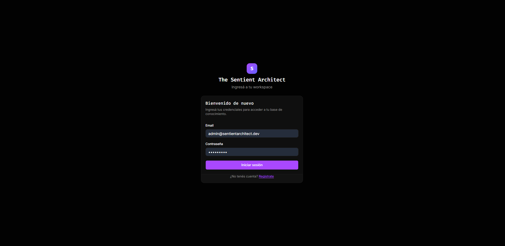
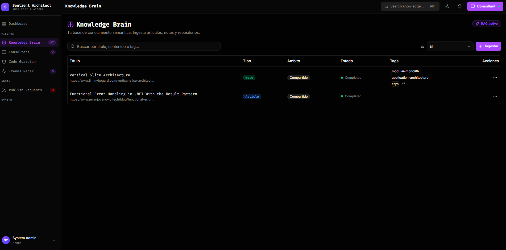
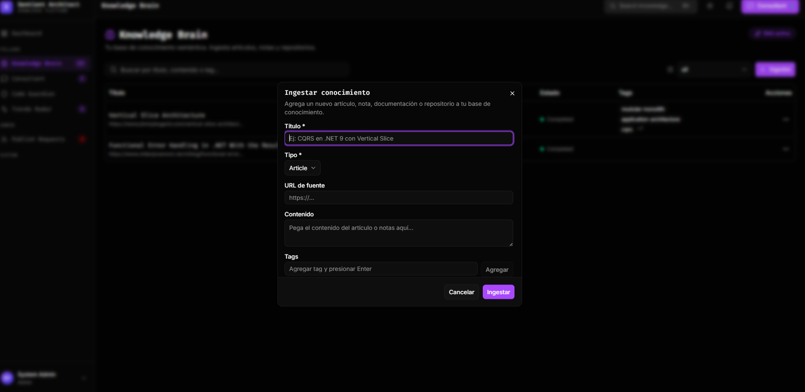
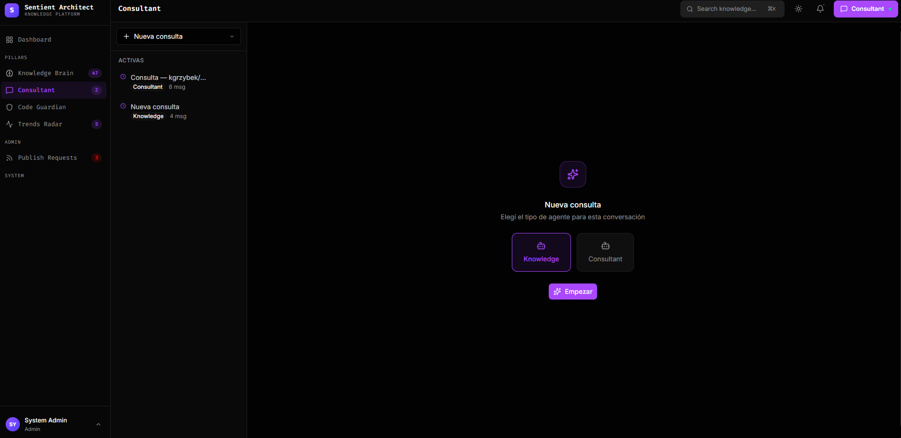
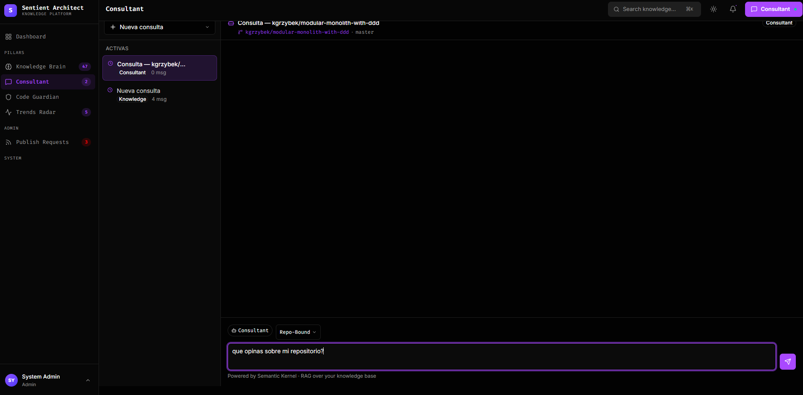
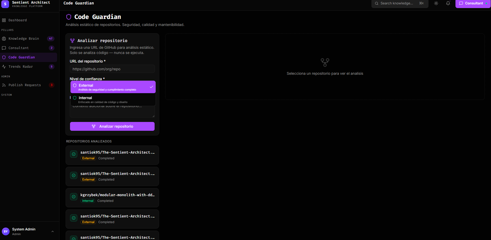
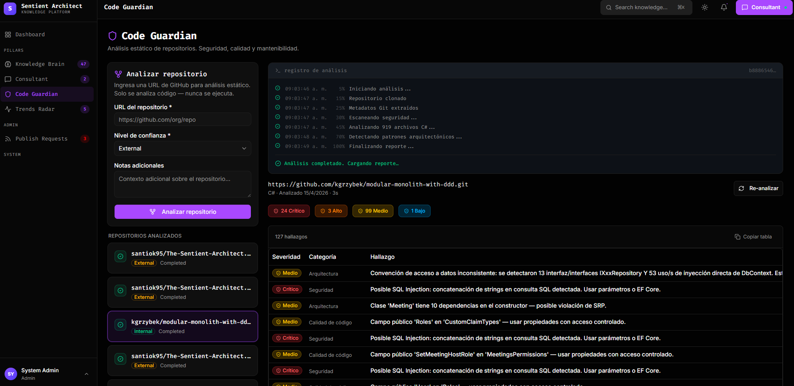
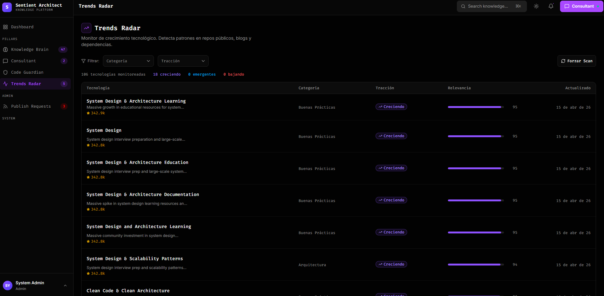

# 🎬 How to Use — The Sentient Architect
### *Recorrido visual por la plataforma, pantalla por pantalla.*

> Esta guía muestra cómo se ve la aplicación en funcionamiento y qué podés hacer en cada sección. Si venís del [README](./README.md) y querés entender cómo se siente usarla, estás en el lugar correcto.

---

## 📑 Índice

1. [Ingreso y autenticación](#-ingreso-y-autenticación)
2. [Home / Dashboard](#-home--dashboard)
3. [🧠 Semantic Brain — Base de conocimiento](#-semantic-brain--base-de-conocimiento)
4. [🤖 Architecture Consultant — Consultas en streaming](#-architecture-consultant--consultas-en-streaming)
5. [🛡️ Code Guardian — Análisis de repositorios](#-code-guardian--análisis-de-repositorios)
6. [📡 Trends Radar — Radar del ecosistema](#-trends-radar--radar-del-ecosistema)
7. [👑 Panel de Administración](#-panel-de-administración)

---

## 🔐 Ingreso y autenticación

La puerta de entrada. Autenticación con JWT, validación client + server, y redirect inteligente (si intentaste acceder a una ruta protegida, te devuelve ahí después del login).



**Qué podés hacer acá:**
- Ingresar con tu email y contraseña.
- Crear una cuenta nueva (pantalla de registro).
- Ser redirigido automáticamente al destino original si tu sesión expiró.

> 💡 Las sesiones viajan en cookie `httpOnly` y se renuevan de forma silenciosa mientras el usuario trabaja.

---

## 🏠 Home / Dashboard

Una vez dentro, el layout principal te muestra todos los pilares al alcance de un click. El sidebar es la consola de mando.



**Qué vas a encontrar:**
- **Sidebar** con los 4 pilares (Brain, Consultant, Guardian, Trends) y acceso al panel admin.
- **Topbar** con tu perfil, indicador de estado de SignalR y atajos rápidos.
- **Vista principal** con tu actividad reciente y accesos rápidos a lo último que trabajaste.

---

## 🧠 Semantic Brain — Base de conocimiento

El corazón del sistema. Todo lo que aprende tu equipo termina acá, indexado semánticamente.


**Qué podés hacer:**
- **Buscar** por título, contenido **o por tag** — la búsqueda entiende el significado, no solo keywords.
- **Ingresar conocimiento nuevo** (artículo, decisión, snippet, referencia) desde el diálogo de ingesta.
- **Ver el detalle** con el contenido completo, metadata, tags, y score de similitud.
- **Solicitar publicación** si tu ítem es personal y querés que pase a ser compartido con el equipo.

### Ingesta de contenido



Al crear un ítem, el backend:
1. Divide el contenido en chunks de 500–800 tokens.
2. Genera embeddings con `text-embedding-3-small` (1536 dimensiones).
3. Los guarda en PostgreSQL + pgvector con índice HNSW para búsqueda sub-lineal.

> ⚡ Con el botón **Cancelar** el formulario realmente se resetea. No hay datos fantasma entre aperturas.

---

## 🤖 Architecture Consultant — Consultas en streaming

Tu socio de diseño, siempre disponible. Conversacional, con memoria, y con acceso directo a tu base de conocimiento y a los reportes de tus repos.



**Qué hace distinto al consultant:**
- **Streaming de tokens vía SignalR** — las respuestas aparecen letra por letra, sin esperar.
- **RAG integrado** — antes de responder, busca automáticamente en tu Semantic Brain.
- **Awareness de tus repos** — si preguntás por un proyecto tuyo, lee el último reporte del Guardian y el ABOUT.md del repo.
- **Awareness de trends** — si preguntás por modernización o alternativas, consulta los snapshots del Trends Radar.
- **Perfil dinámico** — aprende de tus preferencias (stack, patrones, formato de respuestas preferido) con confirmación explícita.

### Ejemplo de opinión sobre un repositorio



El agente combina análisis estático, contexto de dominio y tu historial para dar una respuesta calibrada — no un consejo genérico de ChatGPT.

---

## 🛡️ Code Guardian — Análisis de repositorios

Tu auditor silencioso. Cloná un repo, y el Guardian te devuelve una foto completa del estado del código.



**Qué podés hacer:**
- **Someter un repositorio** (URL de GitHub) con un nivel de confianza: `Internal` o `External`.
- **Ver el progreso en vivo** — cada paso del análisis llega por SignalR mientras corre.
- **Re-analizar** cuando querés una foto actualizada (los resultados previos quedan visibles mientras corre el nuevo análisis).
- **Copiar la tabla de hallazgos** al portapapeles en un click.
- **Filtrar por severidad** (Critical / High / Medium / Low).

### Log en vivo del análisis



Cada línea del análisis (clone → scan → roslyn → deps → completado) se streamea en tiempo real. No hay spinners eternos sin feedback.

### Tabla de hallazgos


Los hallazgos están categorizados por:
- **Severidad** — Critical, High, Medium, Low.
- **Categoría** — Security, Quality, Maintainability, Architecture.
- **Archivo** — ruta exacta para localizar el problema.

> 🔒 **Regla cardinal:** el Guardian NUNCA ejecuta código del repo analizado. Todo es análisis estático (AST + dependency graph + metadata git).

---

## 📡 Trends Radar — Radar del ecosistema

Tu periscopio sobre el ecosistema tecnológico. Snapshots históricos de frameworks, librerías y herramientas.



**Qué podés hacer:**
- **Ver el radar completo** con los niveles de tracción (Emerging, Growing, Mainstream, Declining).
- **Explorar cada item** con su ABOUT.md curado (descripción, casos de uso, pros/cons, alternativas).
- **Filtrar por categoría** (Frontend, Backend, AI/ML, DevOps, etc.).
- **Consultar al Consultant** que usa estos datos automáticamente cuando le preguntás por modernización.

### Detalle de un item del radar


Cada tecnología tiene su propio contexto — no es solo un nombre en una lista. El Consultant lee esto cuando necesita recomendar alternativas reales y no inventadas.

---

## 👑 Panel de Administración

Para usuarios con rol `Admin`. El centro de control de contenido compartido y moderación.


**Qué podés hacer como Admin:**
- **Revisar pedidos de publicación** — cuando un usuario quiere pasar un ítem personal a compartido, cae acá.
- **Aprobar o rechazar** con un comentario de feedback.
- **Ver estadísticas** de ingesta y uso del sistema.
- **Gestionar usuarios** y roles.

> 💡 El contenido del Brain empieza siendo personal (`TenantId = userId`). Solo pasa a ser compartido con el equipo (`TenantId = orgTenantId`) tras la aprobación explícita de un Admin.

---

## 🎯 Flujo típico de un día

```
┌──────────────────────────────────────────────────────────────────┐
│ 1. Entrás → Login                                                │
│ 2. Consultant → "¿Qué decidimos sobre caching el mes pasado?"   │
│    → RAG busca en Brain, responde con link al ítem original.    │
│ 3. Guardian → Subís el PR de esta mañana para auditar.          │
│    → Ves hallazgos en vivo, arreglás lo crítico antes de mergear│
│ 4. Brain → Ingesás la nueva decisión arquitectónica de la reu.  │
│ 5. Trends → Chequeás qué surgió esta semana en el radar.        │
└──────────────────────────────────────────────────────────────────┘
```

---

## 📸 Sobre las capturas

Las imágenes de esta guía viven en [`docs/screenshots/`](./docs/screenshots/). Si ves un placeholder roto, probablemente estás en una build anterior a la publicación de assets — revisá el último release.

---

**¿Listo para empezar?** Volvé al [README](./README.md) para las instrucciones de setup y despliegue.
